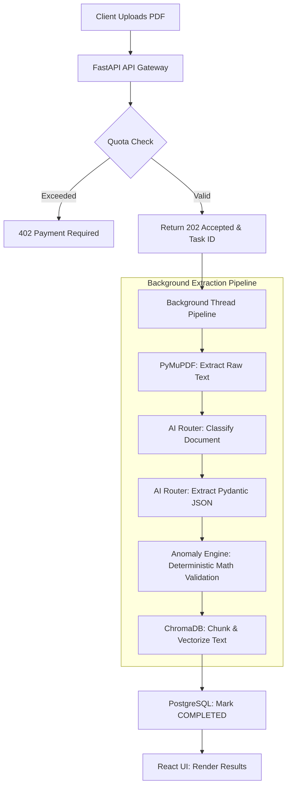

# DocFlow: AI-Powered Document Intelligence

DocFlow is a robust, full-stack application that leverages Retrieval-Augmented Generation (RAG) and Large Language Models (LLMs) to intelligently analyze, extract, and chat with complex PDF documents. 

Built with an emphasis on security, scalability, and clean architecture, DocFlow acts as a provider-agnostic engine that can seamlessly switch between AI providers (Google Gemini, OpenAI, Hugging Face, etc.) to optimize for cost and performance.

## Features

- **Intelligent RAG Pipeline:** Securely uploads, chunks, and indexes PDFs into a local ChromaDB vector store.
- **Provider-Agnostic AI:** A decoupled `AIRouter` interface allows dropping in any LLM provider via a standard adapter pattern.
- **Background Processing:** Heavy extraction tasks are offloaded to asynchronous background workers to prevent blocking the FastAPI event loop.
- **Secure & Multi-Tenant:** Implements full JWT authentication. Document vectors and PostgreSQL task records are strictly scoped to the authenticated `user_id`.
- **API Rate Limiting & Quotas:** Protects expensive LLM calls using database-level upload quotas and Token Bucket rate limiting (via `slowapi`) to prevent DoS and abuse.
- **Modern React Dashboard:** A highly responsive React/Vite frontend featuring live workflow visualizations, real-time extraction logs, and an integrated RAG chat interface.

## Pipeline Working Flow

When a user uploads a document, the API returns a `202 Accepted` immediately. The document is then passed to an asynchronous background worker that executes the following deterministic pipeline:



## Architecture

### Backend (Python/FastAPI)
- **Framework:** FastAPI
- **Database:** PostgreSQL (via SQLAlchemy & Alembic)
- **Vector Store:** ChromaDB
- **PDF Parsing:** PyMuPDF (fitz)
- **Rate Limiting:** SlowAPI (Token Bucket)

### Frontend (React/Vite)
- **Framework:** React 18, Vite
- **Styling:** Tailwind CSS, Lucide Icons
- **State Management:** React Hooks with custom polling logic

## Getting Started

### Prerequisites
- Python 3.12+
- Node.js 18+
- API Keys for your preferred LLM (e.g., `GEMINI_API_KEY` or `HF_TOKEN`)

### Production Deployment (Automated)

This repository is pre-configured for automated Infrastructure-as-Code (IaC) deployment.

**Backend (Render.com)**
Simply connect this repository to Render and create a **Blueprint**. The `render.yaml` file will automatically provision a free PostgreSQL database and deploy the FastAPI backend. You only need to provide your AI provider's API key in the Render dashboard.

**Frontend (Netlify)**
Connect this repository to Netlify. The `netlify.toml` file will automatically configure the build commands and SPA routing. Make sure to set the `VITE_API_URL` environment variable to your live Render backend URL before deploying.

### Local Setup (Development)

**1. Backend**
```bash
cd backend
python -m venv venv
source venv/bin/activate  # On Windows: venv\Scripts\activate
pip install -r requirements.txt

# Run migrations
alembic upgrade head

# Start the server
uvicorn main:app --reload --port 8000
```

**2. Frontend**
```bash
cd frontend
npm install
npm run dev
```

Navigate to `http://localhost:5173` to view the application.

## Security Note

This repository enforces strict `.gitignore` rules to prevent the accidental commit of `.env` files, databases (`*.db`, `*.sqlite3`), and user uploads. Never commit sensitive credentials to version control.
